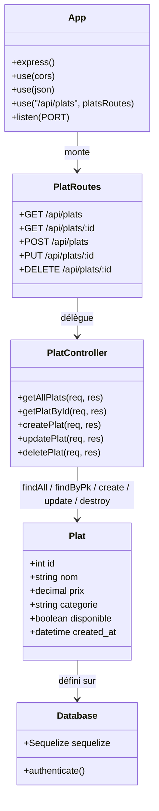

# Diagramme de classes — Snack Dyali (v1, Jour 1)

Architecture backend à construire aujourd'hui : connexion DB → modèle `Plat` → controller → routes → app Express.

## Notes

- Ce diagramme est la **v1** (jour 1, backend uniquement). Une v2 sera ajoutée plus tard pour le côté mobile (écrans, hooks TanStack Query, tâche de fond, cache AsyncStorage).
- Fichiers correspondants :
  - `App` → [`backend/src/app.js`](../backend/src/app.js)
  - `PlatRoutes` → [`backend/src/routes/plats.routes.js`](../backend/src/routes/plats.routes.js)
  - `PlatController` → [`backend/src/controllers/plats.controller.js`](../backend/src/controllers/plats.controller.js)
  - `Plat` → [`backend/src/models/plat.js`](../backend/src/models/plat.js)
  - `Database` → [`backend/src/config/db.js`](../backend/src/config/db.js)
